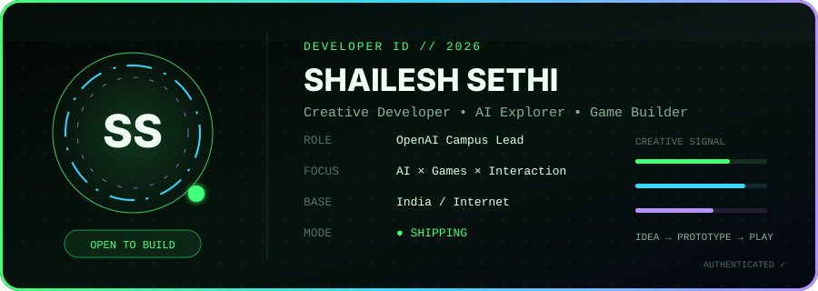

## 👋 About me

- 🚀 I build **playful, high-performance digital experiences** where AI, games, engineering, and motion collide.
- 🧠 I’m exploring **AI-powered products**, creative interfaces, and new ways to learn through play.
- 🎮 I love rapid game prototyping, expressive interactions, and products that feel alive.
- 🌱 I’m currently growing as an **OpenAI Campus Lead** and creative technologist.
- 🤝 I’m open to ambitious collaborations, hackathons, and unusual product ideas.
- ⚡ Fun fact: if an idea sounds slightly impossible, I probably want to prototype it.

## 🚀 Featured builds

<strong>🛡️ SAFEZONES</strong> — Real-time emergency intelligence <code>3rd Place</code>

 

> A fast, action-first safety dashboard designed to turn live signals into clear emergency decisions.

`Next.js` `WebSockets` `Real-time systems` `Product design`

**[Launch project →](https://safezones.vercel.app/)**

<strong>⚡ TELEPORT KILLER</strong> — Neon cyberpunk combat experiment <code>Top 10</code>

 

> A high-energy game prototype built around teleportation, momentum, and sharp visual feedback.

`C++` `Unreal Engine` `Game design` `Rapid prototyping`

**[Enter the arena →](https://www.jabali.ai/game/574e925c-814c-4655-b0c2-18d4b8d1f1de/create-from-scratch/teleport-killer/)**

<strong>🏆 VIBE CODE QUEST</strong> — Learn prompting through play <code>Winner</code>

 

> An 8-bit learning adventure that transforms better AI prompting into quests, feedback, and discovery.

`AI/ML` `Game development` `Learning experience` `Pixel UI`

**[Start the quest →](https://app-b0pl8qd02cjl.appmedo.com/)**

<strong>💚 MEOWCARE</strong> — Accessible remote care <code>Built with care</code>

 

> A calm mobile care experience focused on accessibility, clarity, and human connection.

`React Native` `UI/UX` `Accessibility` `Mobile product`

## 🛠️ Technical arsenal

### Languages

### Frameworks & creative tools

### Workflow

  

## 📊 GitHub stats

## 🐍 Contribution stream

<picture>
  <source media="(prefers-color-scheme: dark)" srcset="https://raw.githubusercontent.com/ShaileshSethi/ShaileshSethi/gh-pages/github-contribution-grid-snake-dark.svg" />
  <source media="(prefers-color-scheme: light)" srcset="https://raw.githubusercontent.com/ShaileshSethi/ShaileshSethi/gh-pages/github-contribution-grid-snake.svg" />
  
</picture>

## 📈 Activity graph

## 🏆 Achievements

| Signal | Achievement | Result |
|:--:|---|---:|
| `OPENAI` | Campus Lead | **2026** |
| `GOOGLE GEMINI` | Student Ambassador | **Shortlisted** |
| `HACK4RELIEF` | Safety-tech challenge | **3rd Place** |
| `JABALI GAME JAM` | Game development competition | **Top 10** |
| `VISIONARY PIXEL × ANDALA AI` | AI creative challenge | **Winner** |

## 🌐 Connect with me

### `TRANSMISSION OPEN`

Got a wild idea, a game mechanic, or a problem worth solving? **[Let’s build it.](mailto:shaileshtunes@gmail.com?subject=Let%27s%20build%20something%20memorable)**

Designed and engineered with curiosity by Shailesh Sethi.

