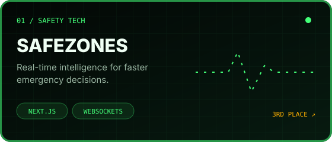
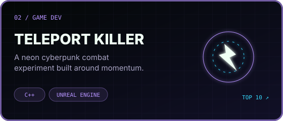
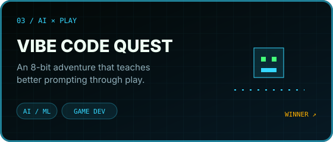
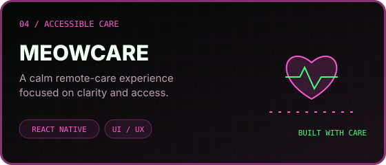

## About me

I’m **Shailesh Sethi**, a creative developer from India and an **OpenAI Campus Lead**. I enjoy building digital experiences where engineering, motion, games, and AI meet.

- I focus on creative frontend development, AI-powered experiences, and game development.
- I care about clear interfaces, meaningful motion, and playful interactions.
- I like taking an idea from rough prototype to something people can actually use.
- I’m open to collaborations, hackathons, and ambitious experiments.

## What I work with

  

## Selected work

<table>
  <tr>
    <td width="50%">
      
    </td>
    <td width="50%">
      
    </td>
  </tr>
  <tr>
    <td width="50%">
      
    </td>
    <td width="50%">
      
    </td>
  </tr>
</table>

Click a project card to explore the live experience.

## Highlights

| Year | Program or challenge | Result |
|:---:|---|---:|
| 2026 | OpenAI | **Campus Lead** |
| 2026 | Google Gemini Student Ambassador | **Shortlisted** |
| 2026 | Hack4Relief | **3rd Place** |
| 2026 | Jabali Game Jam | **Top 10 Finalist** |
| 2026 | Visionary Pixel × Andala AI | **Winner** |

## GitHub activity

<picture>
  <source media="(prefers-color-scheme: dark)" srcset="https://github-readme-stats.vercel.app/api?username=ShaileshSethi&show_icons=true&hide_border=true&bg_color=030705&title_color=43FF78&text_color=DFFFE8&icon_color=FFB000&ring_color=43FF78" />
  <source media="(prefers-color-scheme: light)" srcset="https://github-readme-stats.vercel.app/api?username=ShaileshSethi&show_icons=true&hide_border=true&bg_color=F6FFF8&title_color=087F5B&text_color=172B20&icon_color=B36B00&ring_color=087F5B" />
  
</picture>
<picture>
  <source media="(prefers-color-scheme: dark)" srcset="https://github-readme-stats.vercel.app/api/top-langs/?username=ShaileshSethi&layout=compact&hide_border=true&bg_color=030705&title_color=43FF78&text_color=DFFFE8" />
  <source media="(prefers-color-scheme: light)" srcset="https://github-readme-stats.vercel.app/api/top-langs/?username=ShaileshSethi&layout=compact&hide_border=true&bg_color=F6FFF8&title_color=087F5B&text_color=172B20" />
  
</picture>

 

<picture>
  <source media="(prefers-color-scheme: dark)" srcset="https://raw.githubusercontent.com/ShaileshSethi/ShaileshSethi/gh-pages/github-contribution-grid-snake-dark.svg" />
  <source media="(prefers-color-scheme: light)" srcset="https://raw.githubusercontent.com/ShaileshSethi/ShaileshSethi/gh-pages/github-contribution-grid-snake.svg" />
  
</picture>

---

### Have an idea worth building?

**[Send me a message](mailto:shaileshtunes@gmail.com?subject=Let%27s%20build%20something%20memorable)**

Built with curiosity by Shailesh Sethi.

